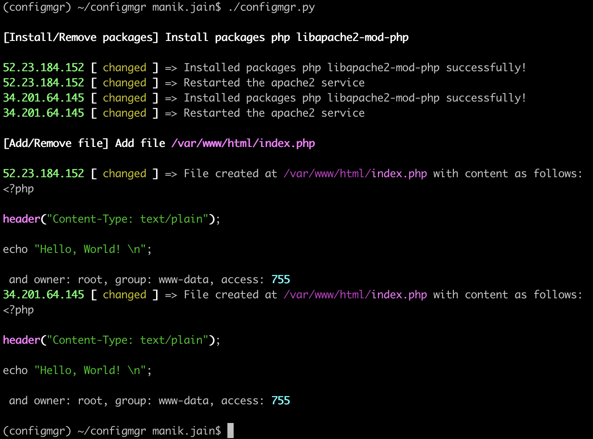
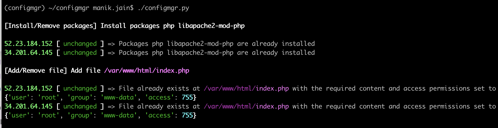
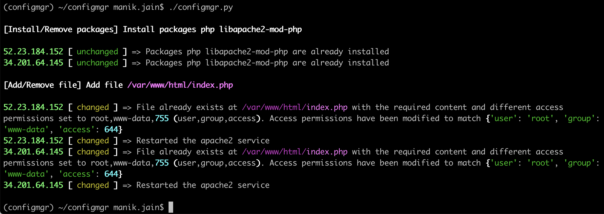
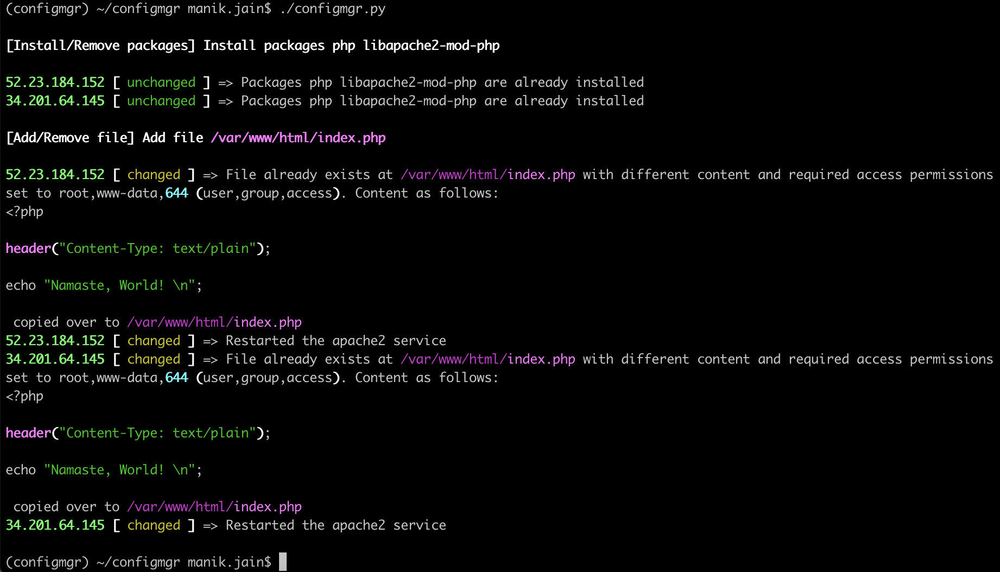
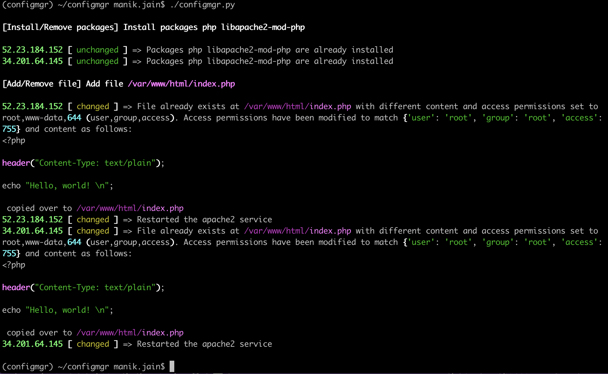
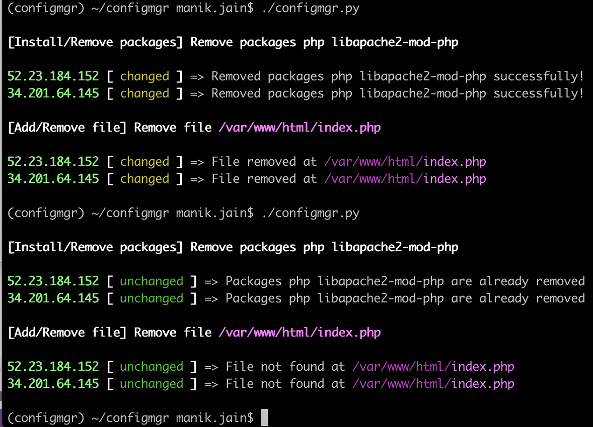
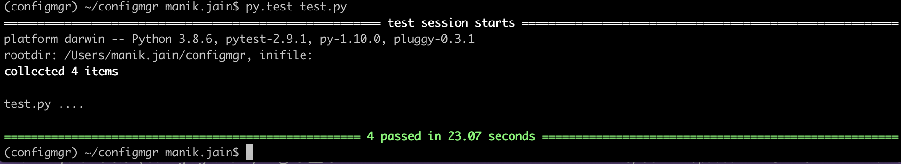

# configmgr (Basic Configuration Management Tool)

Authored and Developed by: `Manik Jain`

This tool (written in Python `v3.8.6`) mimics a basic configuration management tool to create/modify/remove files and/or install/remove debian packages on a list of hosts.

Table of Contents
=================
* [Architecture](#architecture)
  * [Folder structure](#folder-structure)
  * [Structure of YAML config](#structure-of-yaml-config)
* [Prerequisites](#prerequisites)
* [Install and run the tool](#install-and-run-the-tool)
  * [Sample run of the tool](#sample-run-of-the-tool)
* [Unit tests](#unit-tests)
  * [Sample run of unit tests](#sample-run-of-unit-tests)

## Architecture

### Folder structure

    .
    ├── configmgr.py                   # Main file to execute the app from
    ├── configmgr_methods.py           # Stores the methods used for SSHclient, file and package operations
    ├── config.yaml                    # Configuration from this file is used to determine the kind of file and package operations to run on the servers
    ├── config.sample.yaml             # Sample configuration file to setup a simple PHP web server
    ├── config_schema.py               # Schema file used for validating config.yaml for required and non-allowed fields.
    ├── tools                          # 
    ├── LICENSE
    └── README.md

### Structure of YAML config

Refer to `config.sample.yaml` for directions on how to write a `config.yaml`. `config.sample.yaml` configures a simple PHP server.

A `config.yaml` is validated against `config_schema.py` for required and non-allowed fields. It can have the following fields:

```
hosts: # List of hosts
  - "x.x.x.x" # IP address
  - "x.x.x.x"
auth: # Authentication info
  password: 'XXXXXXXXXXXX'
  host_keys_path: '/path/to/known_hosts'
file: # OPTIONAL: For file operations
  path: "/path/to/file"
  name: "filename"
  content: |
    LINE 1

    LINE 2

    LINE 3

    ...
  permissions:
    user: username
    group: group
    access: 644 # Octal permissions
  state: present # To create or modify a file's content and/or permissions OR
  state: absent # To remove a file
  restart_service: apache2 # OPTIONAL: To restart a service alongside
package: # OPTIONAL: For package installation/removal
  name: # List of packages
    - "php"
    - "libapache2-mod-php"
  state: present # To install or modify the packages OR
  state: absent # To remove packages
  restart_service: apache2 # OPTIONAL: To restart a service alongside
```

## Prerequisites:
1. Python (> `v3.8.6` or higher) must be installed on your machine. Find and download the appropriate version from [https://www.python.org/downloads/](https://www.python.org/downloads/), if not already installed.
1. For SSH: List of host IPs and a password to authenticate as root with them. (**Note:-** *For the purposes of this tutorial, SSH root login is used in the application. However, this method of authentication is not recommnended in a production environment. In a production environment, a more secure way such as SSH key based authentication must be used.*)

## Install and run the tool
1. With this project directory as the current directory, create a Python virtual environment with `python3 -m venv configmgr`.
1. Activate the virtual environment with `source configmgr/bin/activate`.
1. Install the required Python modules with `pip install -r requirements.txt`.
1. Make sure to have `config.yaml` in the current directory with all the necessary config settings (refer to `config.sample.yaml` for directions). Be sure to add the list of `hosts` and `auth` setting.
1. Run `./configmgr.py`.

### Sample run of the tool

Most of sample scenarios below cover the ways in which the configuration on the servers can be managed:

- **SCENARIO 1:** Fresh install of a simple PHP web server. Also, checks for idempotence.





- **SCENARIO 2:** Changing the file access permissions from 755 to 644.



- **SCENARIO 3:** Changing the file content.



- **SCENARIO 4:** Changing both file content and permissions.



- **SCENARIO 5:** Removing everything (mark all states as 'absent'). Also, check for idempotence.



## Unit tests

There are four tests added to `test.py` to check SSH connectivity, package installation, file creation and service restart:

1. Ensure that all dependencies are installed using `pip install -r requirements.txt`. These tests use `pytest` module.
1. Ensure `test_config.yaml` is configured correctly with a host IP and auth information added.
1. To execute unit tests, run `py.test test.py` from within the main repository directory.

### Sample run of unit tests

